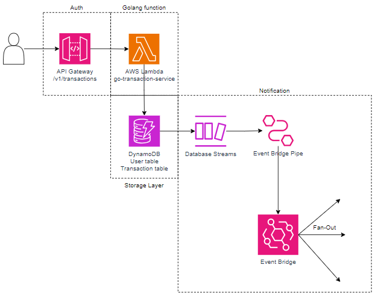
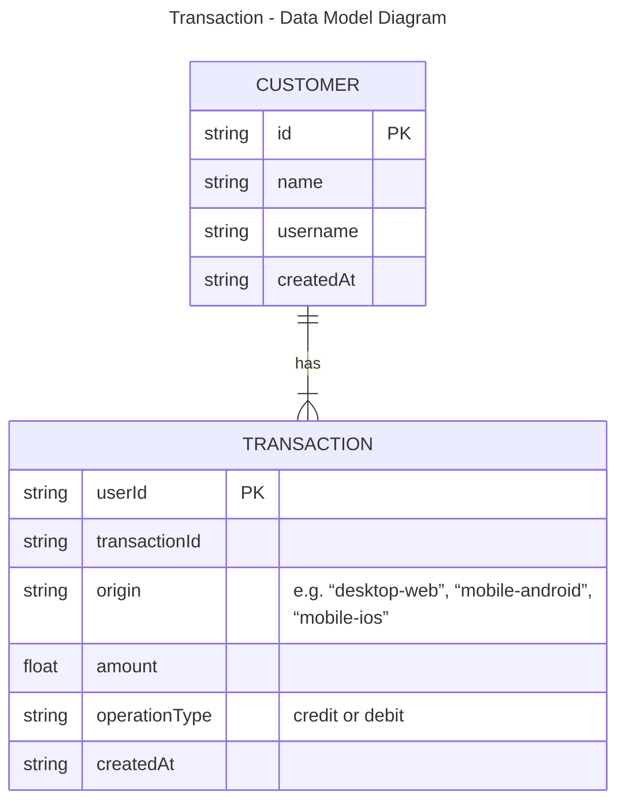

# go-transaction-service
It is a proof of concept (PoC) for a service written in Golang using hexagonal architecture. 

The idea for the notification implementation (pub/sub pattern) is to use low code, taking advantage of cloud resources.

Additionally, it includes samples of a concurrency pattern (workerpool) and unit testing.

## Design
* [draw.io - diagram](https://viewer.diagrams.net/?tags=%7B%7D&highlight=0000ff&edit=_blank&layers=1&nav=1&title=go-transaction-service-serverless.drawio#R7VrbcqM4EP0aPyaFwBj7MfiSmSrPrKu8u7P7lJJBBs0Acgn5tl%2B%2FLRDGWPgyFRzHlcwkFdRqoVafPq0W0LL68eaZ40X4jfkkapmGv2lZg5ZpIsM24I%2BUbHOJLVtSEHDqK6VSMKX%2FkWKkki6pT9KKomAsEnRRFXosSYgnKjLMOVtX1eYsqs66wAHRBFMPR7r0B%2FVFmEu7plPKvxAahMXMqNPLe2JcKKuVpCH22XpPZA1bVp8zJvKreNMnkXRe4Zd83OhI784wThJxyYDRExF%2FL1dPP8PF2CMjO3C%2FPD%2BYnfw2Kxwt1Yq%2FM0Hn1MOCskRZLraFOzhbJj6RdzRalrsOqSDTBfZk7xoCAGShiCNoIbic0yjqs4hxaCcsASXXx2mYDZf9EZ6RaMJSmk1lDTxYCQFld0W4AAui8YGCYHIGHNGgVv1JdcyYECyGDrU26Cabo15DOywgiAmLieBbUFED2kghreLXLAJ6XUaD5Vi5LNyLBKurFLGKwGB37xIkuFA4%2FQZmqKPBQnwIWtVkXIQsYAmOhqXUrQJX6oyZ9GkGx08ixFYxEC8Fq4KZzyknOu1JsIstuUdOLUDxGPOAiFN6R6DhJILoXFUNad7NGjM0twOlF5m3PCGD%2FBwfGgjHIqhUNCJLj8a2oQdj51qxWOOU%2B4rFzoWx6NwyFPUkPVzJlZqGC5smeME0JhQiUYvPX0R4YeHnpYhoQvq7jVIK5ywRRYpumRb8H0m73IBjn5KyT6Xv%2FYwO6kMH2Y4L8lRw9oscy%2FXGiZS%2By9WHSfxIrt%2FfXsB2FSLILNpq8XJKnC7yhc7pRtrhLhiVd8l8l6qbFBSON4EsYB7xOm0%2FEqkxy1z7sgDHps2Q1z5gr9ntauztvCV7kc7eV3OTbKj4Z%2B%2F6X3mrR1u1Bht156yx3WtMCKewKglyJmuQ46%2Flrho6keFToulYVTTb9gFMeU5Row6Q2pnxCvCsO0%2B9V4KlXYXFRr23haX9yanGONVBb8sp5%2BxGe2qHzfaXzFDbhR8wvZ%2F%2F2qDal5JH064R1skcXYh0NfiD6mY4FNbJHF2IdDXZKqyuCutkjq1bfDga1YxGB6Ph5zcLlssqE%2BiZZ%2F%2FeY3lSW4pwklPxqyftcaGZXx0tWBoqVRxU3dy6%2BkHD6eqlSiFr%2FqBhaNy7r92ue%2BFBo3fLg0ZXy3%2BDbYJjNgBPdCIw251xuArk1V8pRLxc0Ax8rfX%2ByXGSwrk4e4hUKH0mz7tInv2eaeeHow%2BRPP0sxP1ZM5nTKh6J7A55vdse8nYZ6l4zZ%2B%2FCzNm5Zebs6ZkTQ9bDqXw4MxWc4Dg9nQCv8HzmCJHv%2FvlMwdiXNHNsQ0%2F67cOnMzcmbnFwvVviFoe3s8zt3pK5hZV71H36MQXBGMczH%2BulTcAeRFndPEAZtKLeZ3VzL9XNcOAgw%2Fgw1U2UR%2FFVahtkIS1F2j09Rdq9a3G3e%2B8p8uJ3oUY9Mm%2BUI%2FWXoU%2BTryB4xoKs8VZPkjDNCgaN9jLlmfrnM0W%2BnxT5sZ6e4QV9CVQgN5InUfFi78Rr%2Brc9A1o6f5dgyek3FR%2Fg8x6I8wpSPR2oHXj7SKHrVf22BtUIJw9%2FLIWGFixbVCGpPefV4HTWxzH1%2FWyzrIuBapQ0gELHOXiVWgNDHV%2Bsq%2FGlrYHwzCKcBCCbLxPv89u4%2FIT83shj6uSZCsZx9onMGG%2FlE%2Bt3hdoOjrPA5fheAbW6Lxobgw2a5Reu%2BVva8jtha%2Fg%2F)



* Data Model



Initially, this is a representation of a NoSQL data model diagram. This is why there is no explicitly mentioned foreign key in the tables

NoSQL was the choice as a high volume of transactions per user is expected, as it can scale horizontally very well,  ensuring stable performance. Since the User ID and transaction ID serve as the partition key with high cardinality, it helps avoid hot partitions.

## Build

```bash
make build
```

## Run Locally
```bash
make local
```

## Deploy - AWS lambda
```bash
make package-lambda

make deploy
```

## Usage
* [Swagger](docs/swagger.yaml) 

### Create a transaction

* Header x-idempotency-key:  it helps you retry requests safely without accidentally doing the same thing twice. When making or changing an object, use an idempotency key.

```
curl --location 'https://{{hostname}}/v1/transactions' \
--header 'x-api-key: ******' \
--header 'x-idempotency-key: 82685d92-49a4-4375-aed2-d0f60dab6692' \
--header 'Content-Type: application/json' \
--data '{
    "amount": 99.9,
    "currency": "dollar",
    "origin": "mobile",
    "user": {
        "id": "abc"
    },
    "operationType": "credit"
}'
```

### Subscribe

It is possible to subscribe to receive all transactions in a specific email.

```
curl --location 'https://{{hostname}}/v1/transactions/subscribe' \
--header 'x-api-key: ******' \
--header 'Content-Type: application/json' \
--data-raw '{
    "protocol": "email",
    "endpoint": "mauriciozanetti86@gmail.com"
}'
```

### List transactions

```
curl --location 'https://{{hostname}}/v1/transactions?limit=3&next={{token}}' \
--header 'x-api-key: ******' 
```