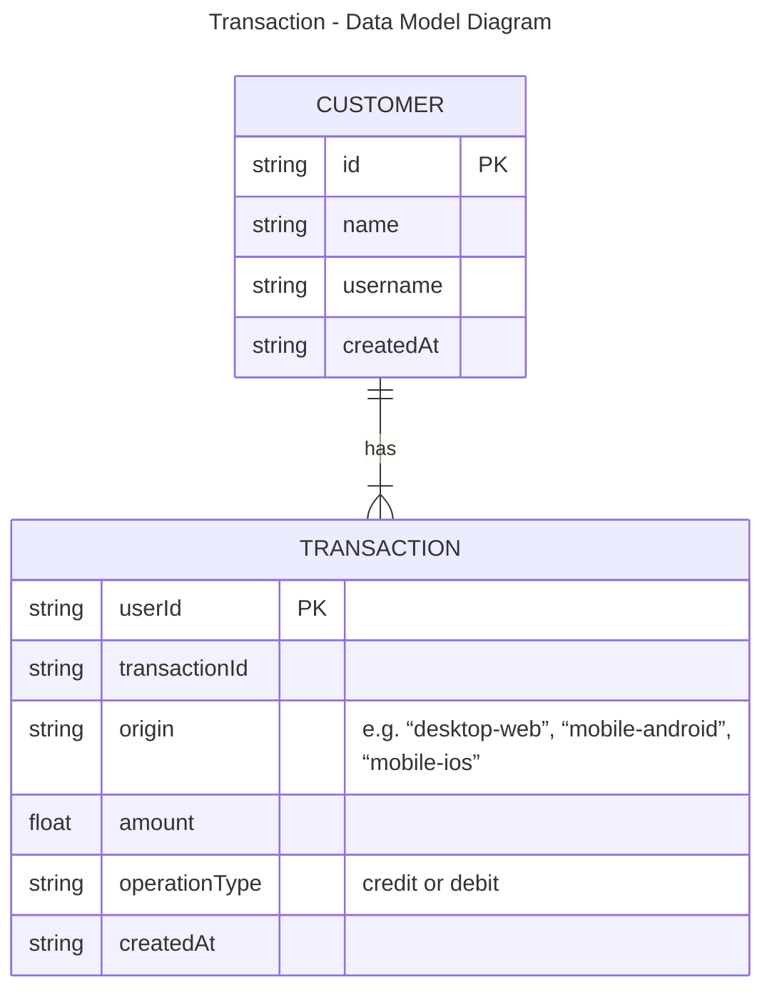

Initially, this is a representation of a NoSQL data model diagram. This is why there is no explicitly mentioned foreign key in the tables

NoSQL was the choice as a high volume of transactions per user is expected, as it can scale horizontally very well,  ensuring stable performance. Since the User ID and transaction ID serve as the partition key with high cardinality, it helps avoid hot partitions.