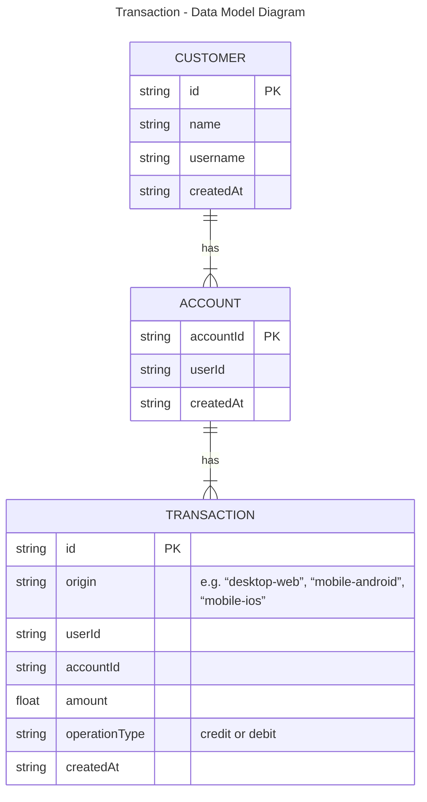

Initially, this is a representation of a NoSQL data model diagram. This is why there is no explicitly mentioned foreign key in the tables

NoSQL was the choice as a high volume of transactions is expected, as it can scale horizontally very well. Since the transaction ID serves as the partition key with high cardinality, it helps avoid hot partitions.